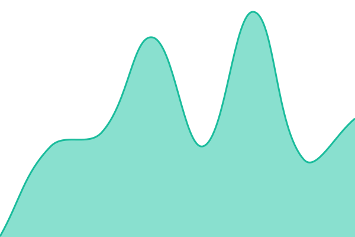
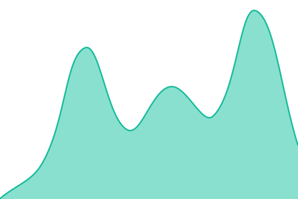
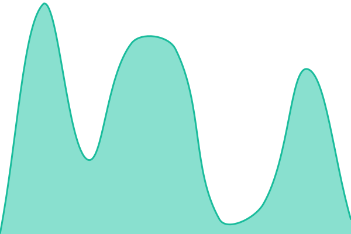

# [📈 Live Status](https://fatahilah-mr.github.io/upptime): <!--live status--> **🟧 Partial outage**

This repository contains the open-source uptime monitor and status page for [Fatahilah](fatahmr.my.id), powered by [Upptime](https://github.com/upptime/upptime).

With [Upptime](https://upptime.js.org), you can get your own unlimited and free uptime monitor and status page, powered entirely by a GitHub repository. We use [Issues](https://github.com/fatahilah-mr/upptime/issues) as incident reports, [Actions](https://github.com/fatahilah-mr/upptime/actions) as uptime monitors, and [Pages](https://fatahilah-mr.github.io/upptime) for the status page.

<!--start: status pages-->
<!-- This summary is generated by Upptime (https://github.com/upptime/upptime) -->
<!-- Do not edit this manually, your changes will be overwritten -->
<!-- prettier-ignore -->
| URL | Status | History | Response Time | Uptime |
| --- | ------ | ------- | ------------- | ------ |
|  [Web Gateway](https://fatah.web.id) | 🟩 Up | [web-gateway.yml](https://github.com/fatahilah-mr/upptime/commits/HEAD/history/web-gateway.yml) | 

 305ms
     
 | 

<a href="https://status.fatah.web.id/history/web-gateway">100.00%</a>
    

|  [Web Portofolio](https://fatahmr.my.id) | 🟩 Up | [web-portofolio.yml](https://github.com/fatahilah-mr/upptime/commits/HEAD/history/web-portofolio.yml) | 

 187ms
     
 | 

<a href="https://status.fatah.web.id/history/web-portofolio">100.00%</a>
    

|  [Web Blog](https://blog.fatah.web.id) | 🟩 Up | [web-blog.yml](https://github.com/fatahilah-mr/upptime/commits/HEAD/history/web-blog.yml) | 

 161ms
     
 | 

<a href="https://status.fatah.web.id/history/web-blog">100.00%</a>
    

|  [Status Anymhost](https://login.fatah.web.id) | 🟥 Down | [status-anymhost.yml](https://github.com/fatahilah-mr/upptime/commits/HEAD/history/status-anymhost.yml) | 

 687ms
     
 | 

<a href="https://status.fatah.web.id/history/status-anymhost">87.24%</a>
    

|  [PERISAI Media Sosial](https://perisai-media-sosial.vercel.app) | 🟩 Up | [perisai-media-sosial.yml](https://github.com/fatahilah-mr/upptime/commits/HEAD/history/perisai-media-sosial.yml) | 

 449ms
     
 | 

<a href="https://status.fatah.web.id/history/perisai-media-sosial">100.00%</a>
    

|  [Web Arifin](https://arifin.fatah.web.id) | 🟩 Up | [web-arifin.yml](https://github.com/fatahilah-mr/upptime/commits/HEAD/history/web-arifin.yml) | 

 236ms
     
 | 

<a href="https://status.fatah.web.id/history/web-arifin">100.00%</a>
    

|  [Web Kwettiau](https://kwettiau.fatah.web.id) | 🟩 Up | [web-kwettiau.yml](https://github.com/fatahilah-mr/upptime/commits/HEAD/history/web-kwettiau.yml) | 

 174ms
     
 | 

<a href="https://status.fatah.web.id/history/web-kwettiau">100.00%</a>
    

<!--end: status pages-->

[**Visit our status website →**](https://fatahilah-mr.github.io/upptime)

## 📄 License

- Powered by: [Upptime](https://github.com/upptime/upptime)
- Code: [MIT](./LICENSE) © [Anand Chowdhary](https://anandchowdhary.com)
- Data in the `./history` directory: [Open Database License](https://opendatacommons.org/licenses/odbl/1-0/)
